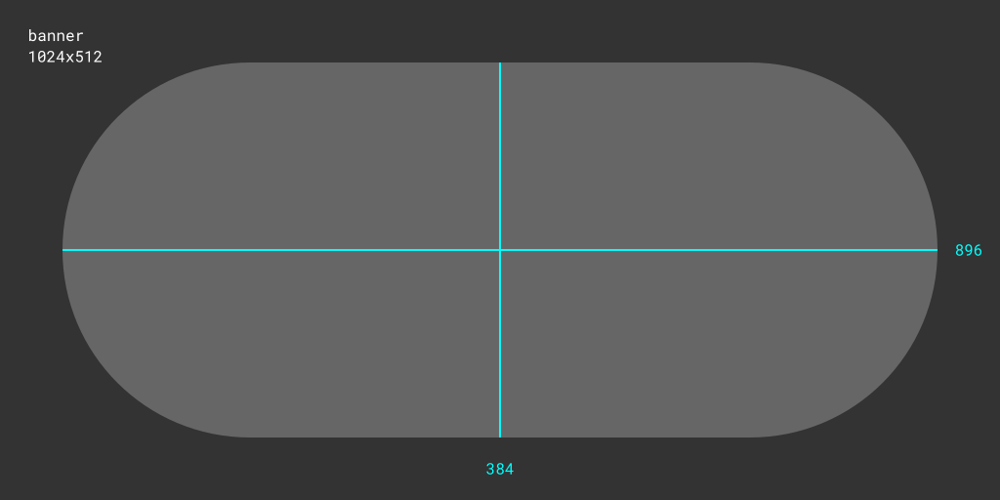

# Untitled Game

## A memorable tagline.

A brief, plain-text description of your game. Give players a quick sense of what to expect in a few short sentences. It appears under your game's title on the product page.

---

Tell players about your game here. This section becomes your game's description. It appears in the **About** section on the product page. Expand on your game, highlight its features, embed media from `.arcadible/gallery/`, and format your description with [Arcadible Markdown](https://developer.arcadible.com/references/arcadible-markdown).

---

Everything after the last horizontal rule is ignored by Arcadible. Use this section for development notes, build instructions, or other repository documentation.

For larger projects, you can instead create an `arcadible.md` file to keep your product-page content separate from your repository's `README.md`.

### References

* [Arcadible Manifest](https://developer.arcadible.com/references/arcadible-manifest)
  * [game.title](https://developer.arcadible.com/references/arcadible-manifest#game.title)
  * [game.tagline](https://developer.arcadible.com/references/arcadible-manifest#game.tagline)
  * [game.bio](https://developer.arcadible.com/references/arcadible-manifest#game.bio)
  * [game.description](https://developer.arcadible.com/references/arcadible-manifest#game.description)
  * [game.gallery](https://developer.arcadible.com/references/arcadible-manifest#game.gallery)
